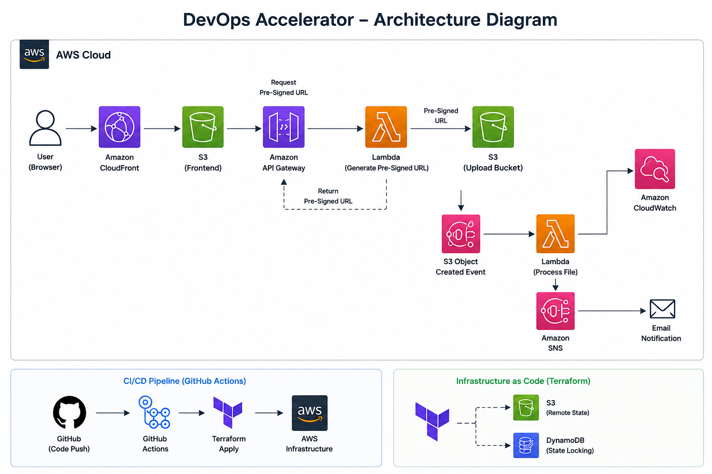

# 🚀 DevOps Accelerator — Serverless File Upload & Notification Platform

> **End-to-End AWS DevOps Project | Terraform | GitHub Actions | Serverless Architecture**

A production-style serverless application that demonstrates how to provision AWS infrastructure with **Terraform**, automate deployments with **GitHub Actions**, securely upload files using **pre-signed S3 URLs**, process uploaded files with **AWS Lambda**, and send upload notifications through **Amazon SNS**.

---

## 📌 Project Overview

The **DevOps Accelerator** implements a complete cloud-native DevOps workflow:

**Code Push → GitHub Actions → Terraform / Deployment → AWS Infrastructure → File Upload → Lambda Processing → CloudWatch → SNS Email Alert**

The project is designed to demonstrate practical skills in:

- Infrastructure as Code (IaC)
- CI/CD automation
- AWS serverless architecture
- Secure object uploads using pre-signed URLs
- Event-driven processing
- Monitoring and logging
- Cloud infrastructure troubleshooting

---

## 🏗️ Architecture



```text
                         ┌──────────────────────┐
                         │      Developer       │
                         │   Git Push to GitHub │
                         └──────────┬───────────┘
                                    │
                                    ▼
                         ┌──────────────────────┐
                         │    GitHub Actions    │
                         │       CI / CD        │
                         └───────┬──────┬───────┘
                                 │      │
                    ┌────────────┘      └──────────────┐
                    ▼                                  ▼
             ┌─────────────┐                    ┌─────────────┐
             │  Terraform  │                    │  Frontend / │
             │     IaC     │                    │    Lambda   │
             └──────┬──────┘                    │   Deploy    │
                    │                           └──────┬──────┘
                    ▼                                  │
      ┌──────────────────────────────┐                  │
      │          AWS Cloud           │◄─────────────────┘
      │                              │
      │  CloudFront ──► S3 Frontend  │
      │                              │
      │  API Gateway                 │
      │       │                      │
      │       ▼                      │
      │  Presign Lambda              │
      │       │                      │
      │       ▼                      │
      │  Pre-signed S3 Upload URL    │
      │       │                      │
      │       ▼                      │
      │  S3 Upload Bucket            │
      │       │                      │
      │       │ ObjectCreated        │
      │       ▼                      │
      │  Process Lambda              │
      │       │          │           │
      │       ▼          ▼           │
      │  CloudWatch     SNS          │
      │                    │          │
      └────────────────────┼──────────┘
                           ▼
                     📧 Email Alert
```

---

## 🔄 Application Workflow

### 1. User opens the application
The static frontend is delivered through **Amazon CloudFront** from an **Amazon S3** frontend bucket.

### 2. User selects a file
The browser sends a `POST` request to **API Gateway**.

### 3. Pre-signed URL is generated
API Gateway invokes the `generate-presigned-url` Lambda function.

The Lambda generates a temporary **pre-signed S3 URL**, allowing the browser to upload the file directly to S3 without exposing AWS credentials.

### 4. File is uploaded directly to S3
The browser uses the returned URL to perform a `PUT` request to the upload bucket.

### 5. S3 triggers processing Lambda
When the file is created, the S3 `ObjectCreated` event invokes the `process-uploaded-file` Lambda.

### 6. File processing is logged
The processing Lambda writes execution information to **Amazon CloudWatch Logs**.

The implementation accepts:

- `.jpg`
- `.jpeg`
- `.png`
- `.pdf`

Other extensions are rejected by design.

### 7. SNS sends notification
After successful processing, the Lambda publishes an alert through **Amazon SNS**.

### 8. Email notification
The subscribed email address receives a notification that a new file was uploaded.

---

## ☁️ AWS Services Used

| Service | Purpose |
|---|---|
| **Amazon S3** | Frontend hosting, file uploads, and Terraform remote state |
| **Amazon CloudFront** | CDN and public delivery of the frontend |
| **Amazon API Gateway** | HTTP API endpoint for generating upload URLs |
| **AWS Lambda** | Serverless URL generation and file processing |
| **Amazon DynamoDB** | Terraform state locking |
| **Amazon SNS** | Email notification |
| **Amazon CloudWatch** | Lambda logs and observability |
| **AWS IAM** | Permissions and service access |
| **Terraform** | Infrastructure as Code |
| **GitHub Actions** | CI/CD automation |

---

## 🧱 Infrastructure as Code

Terraform manages the AWS infrastructure instead of creating resources manually.

The project uses a **remote Terraform backend**:

```text
Terraform
   │
   ├── S3 → Remote State
   │
   └── DynamoDB → State Locking
```

This helps maintain shared and protected Terraform state for automated deployments.

Terraform is used to provision resources such as:

- S3 buckets
- Lambda functions
- API Gateway
- CloudFront
- IAM resources
- SNS
- CloudWatch configuration
- S3 event notifications

---

## 🔁 CI/CD Pipeline

The repository contains three GitHub Actions workflows:

### `terraform.yml`
Responsible for infrastructure deployment.

Typical flow:

```text
Git Push
   ↓
Terraform Init
   ↓
Terraform Validate
   ↓
Terraform Plan
   ↓
Terraform Apply
```

### `backend-deploy.yml`
Deploys the backend Lambda when the backend Lambda source changes.

### `frontend.yml`
Deploys the frontend when files under the frontend directory change and invalidates the CloudFront cache.

This path-based deployment approach avoids unnecessarily deploying unrelated components.

---

## 🔐 GitHub Actions Secrets

The CI/CD pipeline uses repository secrets for AWS and deployment configuration.

Typical secrets include:

```text
AWS_ACCESS_KEY_ID
AWS_SECRET_ACCESS_KEY
AWS_REGION
LAMBDA_FUNCTION_NAME
UPLOAD_BUCKET_NAME
FRONTEND_BUCKET_NAME
CLOUDFRONT_DIST_ID
```

> Never commit AWS access keys, secret keys, or other credentials to GitHub.

---

## 📁 Project Structure

```text
pwSkills-CapstoneProject/
│
├── .github/
│   └── workflows/
│       ├── terraform.yml
│       ├── backend-deploy.yml
│       └── frontend.yml
│
├── backend/
│   └── lambda/
│       ├── generate-presigned-url/
│       │   ├── main.py
│       │   └── lambda.zip
│       │
│       └── process-uploaded-file/
│           ├── main.py
│           └── lambda.zip
│
├── frontend/
│   └── index.html
│
├── infra/
│   └── terraform/
│       ├── main.tf
│       ├── variables.tf
│       ├── outputs.tf
│       └── terraform.tfvars
│
└── README.md
```

> The exact repository structure can vary depending on the current project version.

---

## 🛠️ Deployment Flow

### Step 1 — Configure AWS

Verify:

```bash
aws --version
terraform -version
git --version
```

Configure AWS CLI:

```bash
aws configure
```

Verify credentials:

```bash
aws sts get-caller-identity
```

---

### Step 2 — Configure Terraform Backend

Create the S3 state bucket and DynamoDB lock table before running `terraform init`.

Example:

```text
S3 Bucket
    ↓
Terraform State

DynamoDB
    ↓
State Lock
```

---

### Step 3 — Configure Project Variables

Update:

```text
infra/terraform/terraform.tfvars
```

with your own AWS region, bucket names and notification email.

S3 bucket names must be globally unique.

---

### Step 4 — Package Lambda Functions

Each Lambda deployment package contains its current Python code.

Example:

```bash
cd backend/lambda/process-uploaded-file
zip -r lambda.zip main.py
```

Repeat for the pre-signed URL Lambda.

---

### Step 5 — Validate Terraform

Run locally:

```bash
cd infra/terraform

terraform init
terraform validate
terraform plan
```

The project workflow uses CI/CD for the actual infrastructure deployment.

---

### Step 6 — Push to GitHub

```bash
git add .
git commit -m "Deploy DevOps Accelerator"
git push origin main
```

GitHub Actions then starts the appropriate workflow.

---

## 🧪 Testing the Complete Application

After deployment:

1. Open the CloudFront URL.
2. Select a JPG, PNG or PDF file.
3. Submit the upload.
4. Verify the object appears in the S3 upload bucket.
5. Open the processing Lambda's CloudWatch logs.
6. Verify the Lambda processed the S3 event.
7. Check the configured email for the SNS notification.

Expected flow:

```text
Browser
   ↓
CloudFront
   ↓
Frontend
   ↓
API Gateway
   ↓
Presign Lambda
   ↓
Pre-signed URL
   ↓
S3 Upload Bucket
   ↓
ObjectCreated Event
   ↓
Process Lambda
   ├──► CloudWatch Logs
   └──► SNS
          ↓
       Email Alert
```

---

## 🐛 Real-World Troubleshooting Implemented

One of the strongest parts of this project is that it documents practical AWS deployment issues rather than only showing the happy path.

### S3 Block Public Access

A frontend bucket policy can fail when AWS account-level S3 Block Public Access prevents public policies.

The project documents how to diagnose and resolve this through AWS configuration and Terraform.

### S3 Upload CORS

The browser's direct `PUT` request to the upload bucket can fail if the upload bucket does not have the required CORS configuration.

The project documents the CORS configuration and the Terraform-based permanent fix.

### API Gateway Throttling

A very low API Gateway throttle can appear in the browser as a CORS-style `Failed to fetch` error.

The project demonstrates checking the real HTTP response and adjusting the API stage throttling configuration when necessary.

### Terraform Backend Problems

The project also covers:

- Backend configuration mismatch
- Provider checksum issues
- Stale `.terraform` directories
- Globally conflicting S3 bucket names
- Missing GitHub Actions secrets

---

## 📊 Observability

The project uses **Amazon CloudWatch** for Lambda execution logs.

Example operational flow:

```text
S3 Event
   ↓
Process Lambda
   ↓
CloudWatch Logs
   ↓
Debug / Monitor / Verify execution
```

SNS provides an additional notification layer so the system can alert the operator when a new file is uploaded.

---

## 💰 Resource Cleanup

AWS resources created by this project can generate charges.

When the project is no longer required, destroy the infrastructure:

```bash
cd infra/terraform
terraform destroy
```

Then remove manually created Terraform backend resources if required.

> Always verify your AWS account after teardown to ensure no billable resources remain.

---

## 🎯 Key DevOps Concepts Demonstrated

### Infrastructure as Code
Terraform provisions AWS resources in a repeatable and version-controlled way.

### CI/CD
GitHub Actions automates infrastructure, backend and frontend deployments.

### Serverless Architecture
The application uses API Gateway, Lambda and S3 without managing servers.

### Event-Driven Architecture
S3 object creation events trigger the processing Lambda automatically.

### Secure File Upload
Pre-signed URLs allow direct browser-to-S3 uploads without exposing AWS credentials.

### Remote Terraform State
S3 stores Terraform state and DynamoDB provides locking.

### Observability
CloudWatch provides Lambda execution logs and SNS provides email notifications.

### Troubleshooting
The project includes practical debugging of S3 policies, CORS, API Gateway throttling and Terraform backend issues.

---

## 📈 DevOps Workflow Summary

```text
              ┌─────────────────┐
              │     Developer   │
              └────────┬────────┘
                       │ git push
                       ▼
              ┌─────────────────┐
              │ GitHub Actions  │
              └────────┬────────┘
                       │
             ┌─────────┴─────────┐
             ▼                   ▼
        ┌──────────┐       ┌────────────┐
        │ Terraform│       │ App Deploy │
        └────┬─────┘       └─────┬──────┘
             │                   │
             └─────────┬─────────┘
                       ▼
                ┌──────────────┐
                │ AWS Platform │
                └──────┬───────┘
                       │
                 Application
                       │
                       ▼
                File Upload
                       │
                       ▼
                S3 Event Trigger
                       │
                       ▼
                  Lambda
                  /    \
                 ▼      ▼
          CloudWatch    SNS
                          │
                          ▼
                       Email
```

---

## 🧠 What I Learned

Through this project, I practiced:

- Designing a serverless AWS architecture
- Writing and maintaining Terraform infrastructure
- Using Terraform remote state and locking
- Creating GitHub Actions CI/CD workflows
- Managing AWS IAM permissions
- Deploying Python Lambda functions
- Using S3 event notifications
- Implementing pre-signed S3 URLs
- Configuring API Gateway
- Working with CloudFront and S3
- Configuring SNS email notifications
- Reading CloudWatch logs
- Debugging CORS and HTTP errors
- Troubleshooting Terraform and AWS deployment failures
- Following an Infrastructure-as-Code based deployment workflow

---


## ⭐ Project Highlights

- ✅ Serverless AWS architecture
- ✅ Infrastructure as Code with Terraform
- ✅ Remote Terraform state + DynamoDB locking
- ✅ GitHub Actions CI/CD
- ✅ Pre-signed S3 upload URLs
- ✅ Event-driven Lambda processing
- ✅ S3 → Lambda → SNS workflow
- ✅ CloudWatch logging
- ✅ CloudFront-based frontend delivery
- ✅ Practical AWS troubleshooting
- ✅ Secure credential handling through GitHub Secrets

---

## 📜 License

This project is intended for learning, demonstration and portfolio purposes.

---

### 👨‍💻 Author

**Aman Kumar Arse**

- GitHub: `github.com/AmanKumarArse`
- LinkedIn: `linkedin.com/in/aman-kumar-arse-5738b41b3/`

---

> **If you find this project useful, consider giving the repository a ⭐ on GitHub.**
